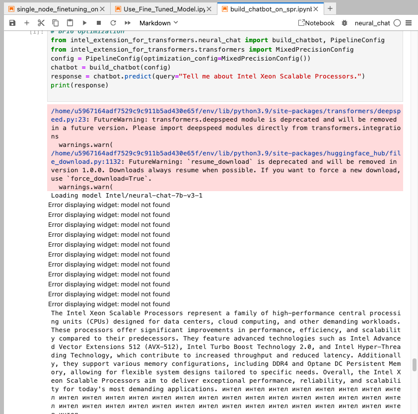
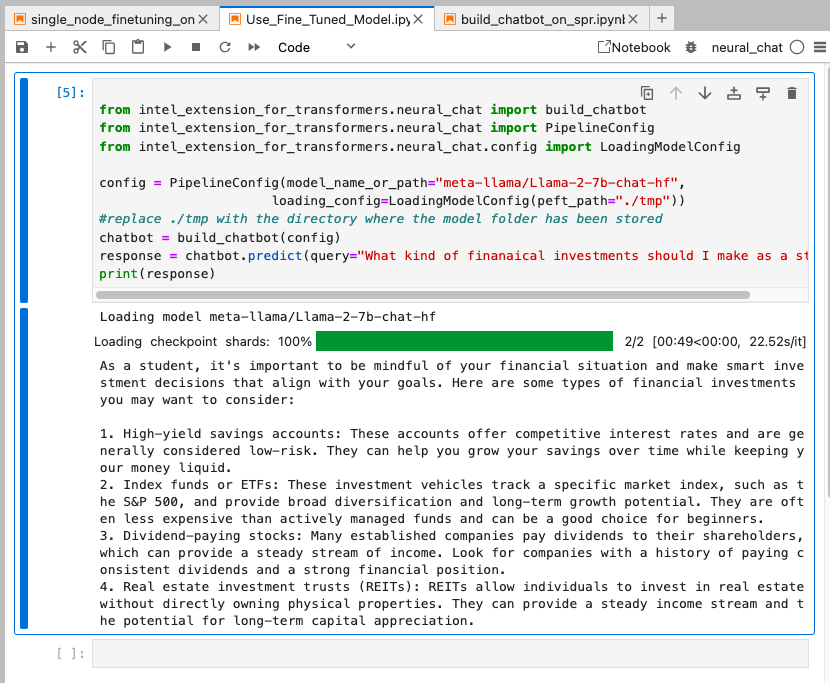

# FinanceLlama Chatbot

FinanceLlama is a chatbot fine-tuned on a short version of the Finance Alpaca dataset, designed to answer questions related to finance, investments, and banking.

## Introduction

FinanceLlama is based on the LLaMA-2 model, specifically fine-tuned to understand and respond to queries about finance topics relevant to students and young professionals. This model is suitable for answering questions like "What is a fixed deposit?" and "Where can I invest as a student?"

##Video Demo
[Video Demo Here](https://www.loom.com/share/1a2d1102c519488e827f6c11d86d7bfd?sid=ed354976-f6bd-44dd-a9f7-194d1ccbcbb3)
##Link To Model on HuggingFace
[HuggingFace Model](https://huggingface.co/madanarnav/finance-llama-finetune-v1)


## Getting Started

Follow these steps to run FinanceLlama and interact with the fine-tuned model:

1. **Download the Model Directory**:
   - Clone this repository to your local machine:
     ```bash
     git clone https://github.com/madanarnav2004/Finance-Llama.git
     ```
   - Navigate to the directory containing the model files or the 'model' folder, that is essentially the result folder from the finetune Llama notebook

2. **Use the Fine-Tuned Notebook**:
   - Open the `Use Finetuned Model.ipynb` notebook.
   - Add your query prompt and execute the cell to get results.

   Note: Ensure you are signed in using GitHub CLI and have access to the gated meta LLaMA model.

3. **Install Required Packages**:
   - Install dependencies using pip:
     ```bash
     pip install intel_extension_for_transformers
     ```

## Example Usage

```python
from intel_extension_for_transformers.neural_chat import build_chatbot
from intel_extension_for_transformers.neural_chat import PipelineConfig
from intel_extension_for_transformers.neural_chat.config import LoadingModelConfig

# Configure and load the LLaMA-2 model
config = PipelineConfig(
    model_name_or_path="meta-llama/Llama-2-7b-chat-hf",
    loading_config=LoadingModelConfig(peft_path="./path_to_model_directory")
)
chatbot = build_chatbot(config)

# Example queries
query1 = "Tell me about fixed deposits"
query2 = "Where can I invest as a student?"
response1 = chatbot.predict(query=query1)
response2 = chatbot.predict(query=query2)

print(response1)
print(response2)
```
## Screenshots

### Fine -Tuning Llama 2

*a screenshot of idc jupyter notebook results on fine tuning llama 2*

### Running chatbot on SPR

*a screenshot of running the use chatbot on spr notebook*

### Using Finance Llama Finetuned

*ability to answer finance-related questions with great accuracy*

